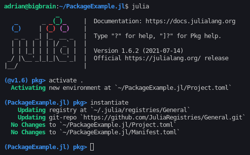
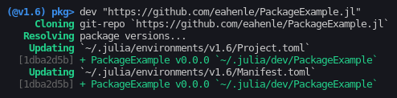

# Julia Package Example

### This is how to make a new development package in Julia and add it to `dev` from the cloud.

First, make a GitHub repository, open a Julia REPL from your local copy of the repo, and enter the following:

```julia
import Pkg
Pkg.activate(".")
Pkg.instantiate()
```

You should see something like this:



Now you should have a `Project.toml` file.  Add the name and UUID for your package, like so:

```
name = "PackageExample"
uuid = "1dba2d5b-3f8e-4db6-9d67-557d7421b403"
```

The UUID must be unique to your project.  You can generate one [online](https://www.uuidgenerator.net/version4), or with the [UUIDs](https://docs.julialang.org/en/v1/stdlib/UUIDs/) Julia package.

You will also have a `Manifest.toml` file.  This can be added to `.gitignore`.

Next, make a folder called `src` and add your module code there.  This example will have its source in `src/PackageExample.jl`, which looks like:

```julia
module PackageExample

"""
This function runs each time the module is imported
"""
function __init__()
    @info "Loaded the example package"
end

"""
This function will be available to the user
"""
function hello_world()
    @info "Hello, world!"
end

export hello_world

end
```

With everything in place on GitHub, you can now add your package to your local development environment:

```julia
Pkg.develop("https://github.com/eahenle/PackageExample.jl")
```

You should see this:


